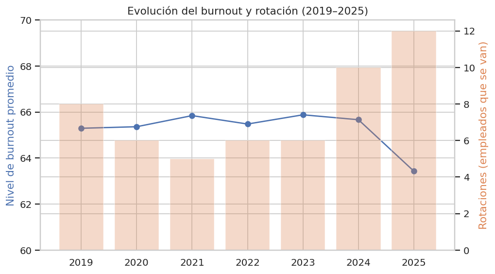
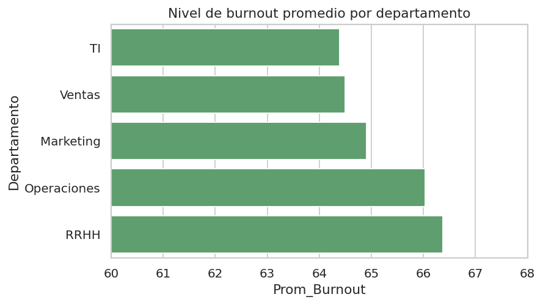
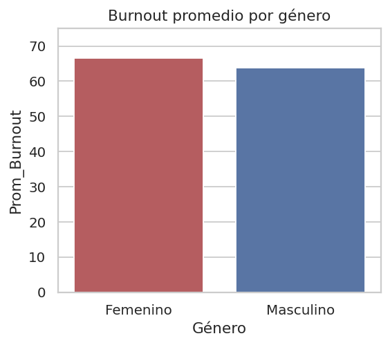
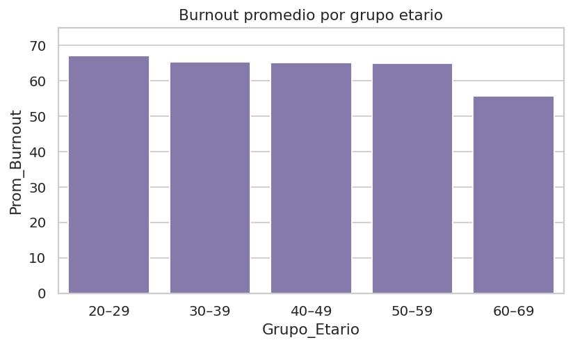

# 📊 Análisis de Síndrome de Burnout Laboral

Proyecto final del curso de **Data Analysis (CoderHouse)**: análisis del síndrome
de burnout en un entorno corporativo, con modelado de datos en esquema
estrella, caso de negocio con stakeholders reales, dashboard interactivo en
Power BI y análisis de KPIs por departamento, género, edad y evolución
temporal (2019–2025).

## 📝 Descripción

Se trabajó con información histórica sobre síndrome de burnout recolectada en
entornos laborales entre 2015 y 2025, distinguiendo departamentos, empleados,
características sociodemográficas, niveles de burnout, días de licencia y
antigüedad. El objetivo: identificar qué áreas, grupos etarios y géneros
concentran mayor riesgo, y su relación con la rotación de personal, para
darle a RR.HH. y Dirección información accionable.

**Destinatarios:** directores y gerentes de RR.HH., psicólogos laborales,
áreas de prevención de riesgos laborales, analistas de datos/BI y directivos
interesados en retención de talento.

## ⭐ Preguntas de negocio

- ¿Cuál es el departamento con mayor nivel promedio de burnout?
- ¿Qué grupo etario y qué género muestran mayor prevalencia?
- ¿Cómo evolucionó el burnout y la rotación entre 2019 y 2025?
- ¿Qué relación existe entre nivel de burnout y antigüedad/rotación?

## 🛠️ Tecnologías utilizadas

Modelado de datos (esquema estrella) · Power BI · Power Query · DAX ·
Excel/Google Sheets · Python (pandas, Matplotlib/Seaborn)

## 📂 Estructura del repositorio

| Archivo | Descripción |
|---|---|
| `Informe_Burnout_Mayrim_Consolidado.pdf` | Informe final completo: caso de negocio, modelo de datos, proceso en Power BI/Power Query (con medidas DAX), visualización, conclusiones, recomendaciones y referencias |
| `Proyecto_PowerBI_Mayrim.pbix` | Dashboard interactivo en Power BI |
| `caso-de-negocio.pdf` | Caso de negocio (avance intermedio del curso): destinatarios, preguntas de negocio, glosario y diagrama entidad-relación |
| `Burnout_Mayrim_ENTREGA_FINAL.xlsx` | Modelo de datos y tablas de análisis (tabla de hechos + KPIs calculados) |
| `evolucion_2019_2025.png`, `por_departamento.png`, `por_genero.png`, `por_edad.png` | Gráficos de los hallazgos principales |
| `make_charts.py` | Script en Python que genera esos gráficos |

## 🗂️ Modelo de datos

Diseñado en **esquema estrella**: una tabla de hechos `Burnout_Laboral`
(nivel de burnout y días de licencia por empleado y período) conectada por
relaciones uno-a-muchos con las tablas dimensión `Empleado` y `Departamento`,
cada una con su propia primary key. Ese mismo modelo está armado como
dashboard interactivo en `Proyecto_PowerBI_Mayrim.pbix`, con carga de datos
en Power Query y medidas DAX (`CALCULATE`, `DATEADD`, `DIVIDE`) documentadas
en el informe.

## 📈 Hallazgos principales

- **100 empleados** analizados a lo largo de **7 años** (2019–2025), con un
  nivel de burnout promedio de **65.3** (escala 30–95) y una tasa de rotación
  del **53%** en el período.
- **RR.HH. y Operaciones** son los departamentos con mayor burnout promedio
  (66.4 y 66.0), y también los de mayor rotación (13 y 15 salidas). **TI** y
  **Ventas** tienen el burnout más bajo (64.4) pero Ventas igual concentra 15
  rotaciones — sugiere que ahí la salida de gente responde a otros factores,
  no solo al burnout.
- El grupo etario **20-29 años** tiene el burnout más alto (67.0), y baja de
  forma sostenida con la edad hasta 55.7 en 60-69 — contraintuitivo si se
  espera que la carga aumente con la seniority.
- El género **femenino** reporta un burnout promedio más alto que el
  masculino (66.5 vs 63.8).
- La rotación **se duplicó entre 2019 y 2025** (de 8 a 12 salidas/año) pese a
  que el burnout promedio bajó levemente en el último año — señal de que la
  rotación no depende solo del nivel de burnout medido, sino probablemente de
  factores externos (mercado laboral, compensación).






## 💡 Recomendaciones

- Monitoreo trimestral y alertas tempranas por área.
- Programas de bienestar y liderazgo saludable en áreas críticas.
- Educación en higiene del sueño y manejo del estrés.
- Evaluaciones periódicas de clima y carga de trabajo.

## 🚀 Cómo correrlo

```bash
pip install pandas matplotlib seaborn
python make_charts.py   # regenera los 4 gráficos a partir de los KPIs
```

## 📌 Nota sobre el dataset base

El dataset original (sin segmentar) usado como punto de partida del curso fue
provisto por la profesora del curso; este proyecto usa el modelo de datos y
el análisis propio desarrollado a partir de esa base — la segmentación en
esquema estrella, las tablas dimensión, los KPIs, el dashboard de Power BI y
el caso de negocio son trabajo propio.
